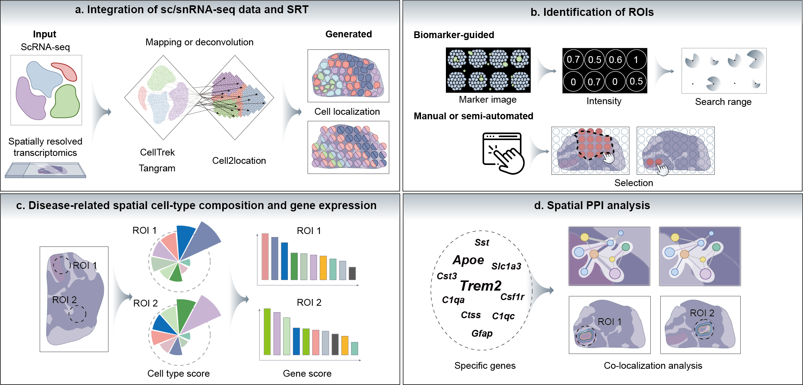

# SpaceNet: A pathology-driven spatial disease network framework for exploring the molecular changes of lesions

SpaceNet is a pathology-guided spatial analysis framework that integrates imaging data with single-cell or single-nucleus RNA sequencing (sc/snRNA-seq) and spatially resolved transcriptomics (SRT). It identifies regions of interest (ROIs) directly from pathological or imaging features and characterizes these regions by detecting enriched cell types, dysregulated gene expression, and spatial co-expression networks.  

This repository describes how to analyse your data with SpaceNet.

Details on SpaceNet: 
* Installation
* Usage
* Relavants

---
## Quick start

### 1. Installation of SpaceNet
    #installation of conda_env, recommended version python3.8.20, consistent with development env
    cd SpaceNet-release
    conda create -n spacenet python=3.8.20 
    conda activate spacenet

    #installation of requirements
    pip install -r requirements.txt

### 2. Accessibility to other softwares/database
choose one to integrate your scRNA-seq data with SRT data
* [CellTrek](https://github.com/navinlabcode/CellTrek)
* [Cell2location](https://github.com/BayraktarLab/cell2location)
* [Tangram](https://github.com/broadinstitute/Tangram)

visit STRING to obtain the lastest complete PPI database, or use [a quick-start version of PPI database](https://figshare.com/ndownloader/files/60897196) (support species: human, mouse, rat)
* [STRING](https://string-db.org/) (Optional)

visualize your result with cytoscape
* [Cytoscape](https://cytoscape.org/)

### 3. Define ROI in your SRT data
use our [tool](https://xomics.com.cn/SpaceNet/Home.php) to select ROI, or save your disease_metric in st_adata.obs

### 4. Running the SpaceNet pipeline on the [example dataset]
example datasets can be accessed [here](https://figshare.com/ndownloader/files/60897196)
* [dot_like_example](https://github.com/ProDong0512/SpaceNet/blob/main/tutorials/tutorial_dotlike.ipynb)
* [band_like_example](https://github.com/ProDong0512/SpaceNet/blob/main/tutorials/tutorial_bandlike.ipynb)

### 5. Expected output

The output of SpaceNet containing:
* file 1: A csv file of enriched cell-types and theirs enrichment score
* file 2: A csv file of enriched genes and theirs enrichment score
* file 3: A csv file of spatial protein-protein interactions net
* file 4: A csv file of gene-celltype net

---

## Relavants and more information
The SpaceNet demonstration video is available in the Releases section of this repository.
Should you have any questions, please contact Menglei Wang at wangml@zju.edu.cn

